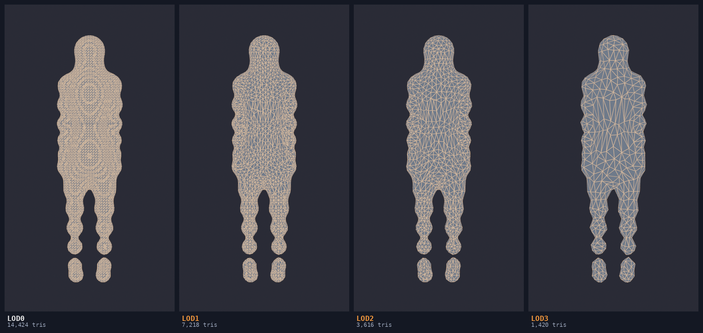

# Rig Tooling Bench

Two Blender add-ons for rigged characters, and the headless benchmark rig they were built against.

Everything here was measured, not asserted. Every figure below comes out of `bench/`, and the results
that went the wrong way are shown alongside the ones that did not.

Tested on Blender 5.0.1. Add-ons require Blender 4.2 or newer.

---

## Character LOD

LOD chains from rigged, shape-keyed characters, to exact triangle budgets, with vertex groups and
blend shapes preserved.

Blender will not do this. Applying a Decimate modifier to a character that has shape keys stops with:

```
Error: Modifier cannot be applied to a mesh with shape keys
```

Four of four test characters. So the usual workaround is to strip the blend shapes first, and then the
second problem arrives: decimating a 7,234-face character at ratio 0.4 leaves **2,712 of 2,895 vertices
with weights that no longer sum to 1.0**, 331 vertices past the four-influence limit game engines
enforce, and a maximum of seven influences on one vertex. Smaller mesh, broken rig.

This add-on captures weights and shape key deltas before touching topology, reduces, then maps both
back onto the new vertices by inverse-distance blend from the nearest source vertices, and renormalises
under the influence cap. Triangle budgets are hit by binary-searching the decimate ratio, because
Blender's ratio acts on triangles and a ratio derived from a face count misses badly on quad and n-gon
meshes.

| Level | Budget | Actual | Budget error | Groups | Shape keys | Unnormalised | Over 4 infl. | Deform error |
|---|---|---|---|---|---|---|---|---|
| LOD1 | 7,176 | 7,182 | 0.1% | 17 / 17 | 4 / 4 | 0 | 0 | 2.70% |
| LOD2 | 3,588 | 3,597 | 0.3% | 17 / 17 | 4 / 4 | 0 | 0 | 2.78% |
| LOD3 | 1,721 | 1,693 | 1.6% | 17 / 17 | 4 / 4 | 0 | 0 | 2.86% |

Four characters, three levels each. Twelve LOD builds with full metrics in 4.3 seconds.
Reproduce with `bench/tests/lod_bench.py`.



---

## Geodesic Weights

Armature binding that measures distance along the mesh surface instead of through the air.

Blender binds with bone heat diffusion, which travels through space, so when a limb rests near the body
the weight leaks across the air gap and the chest drags when the arm lifts. It is a standing complaint
with no number attached to it, so the first job was to produce the number: rotate one arm bone 1.2
radians and count torso vertices that move. There is no legitimate mechanism by which rotating an arm
moves the sternum.

**62.9% of torso vertices move.** And straight out of the bind, 33,885 of 35,826 vertices do not sum to
1.0, with 5,190 past the four-influence limit before anyone decimates anything.

| Binding | Torso bleed | Joint jaggedness | Unnormalised | Over 4 influences |
|---|---|---|---|---|
| Bone heat, untouched | 62.88% | 1.83 | 33,885 | 5,190 |
| Bone heat + Limit Total + Normalize All | 60.88% | 1.87 | 0 | 0 |
| Geodesic + surface smoothing | **44.77%** | 2.17 | 0 | 0 |

Twenty character builds, five metrics each, ten seconds. Reproduce with `bench/tests/real_ab.py`.

### Where it loses

The middle row is the one that matters. Blender's own two operators, run in the correct order, fix
weight validity completely and do almost nothing for bleed, so the honest comparison is against that row
and not against the untouched bind.

Against it, geodesic binding removes **26.5% of the bleeding vertices** and pays for it with joint
deformation **16% rougher**. Uniform Laplacian smoothing restores the blend at the joint but undoes the
geodesic separation at the same rate, because it does not know where one bone's region ends. Smoothing
constrained to region boundaries is the fix; bounded biharmonic weights are the published form of it.
That work is not done.

---

## The bench

`bench/` is the measurement rig. It runs headless, with no GUI and nobody looking at anything.

- `src/organic.py` metaball bodies converted and voxel-remeshed to a single welded manifold surface on a
  17-bone skeleton, deterministic per seed, with shape keys.
- `src/metrics.py` per-vertex influence counts, weight sum error, orphan vertices, effective bones per
  vertex, deformation displacement across a pose library.
- `src/viz.py` vertex-colour field visualisation and wireframe passes through Cycles.
- `tests/` corpus runners, A/B harnesses and parameter sweeps, each asserting the invariants a corpus
  must satisfy before it counts as a benchmark at all, so a broken test set fails loudly instead of
  returning a flattering number.

```
pip install bpy scipy numpy
python bench/tests/lod_bench.py
python bench/tests/real_ab.py
```

---

## Two results thrown away

Both were caught by the bench before anything was published.

**A benchmark that could not measure the thing.** The first test characters were unions of separate
boxes, so the mesh had disconnected shells and surface distance between them was undefined. The method
scored a 16% improvement on that corpus and 93% on properly welded bodies. The benchmark was wrong, not
the algorithm. Found by running a connected-components count on the mesh edge graph.

**A 93% that was fake.** Near-zero bleed can also mean every vertex snapped to exactly one bone, which is
rigid binding and deforms like cardboard. Measuring effective bones per vertex showed 76.9% of vertices
rigid and the surface more than twice as jagged as bone heat. The number was discarded and the
jaggedness check became permanent.

---

## Install

Download a zip from `dist/`, then in Blender: **Edit > Preferences > Add-ons > Install from Disk**.

- Character LOD: select the character mesh, then **Object > Character LOD**
- Geodesic Weights: select the mesh parented to an armature, then **Object > Parent > Geodesic Weights**

`dist/` also has demo `.blend` files for each.

## Licence

GPL-3.0-or-later, as Blender add-ons must be. See `LICENSE`.
